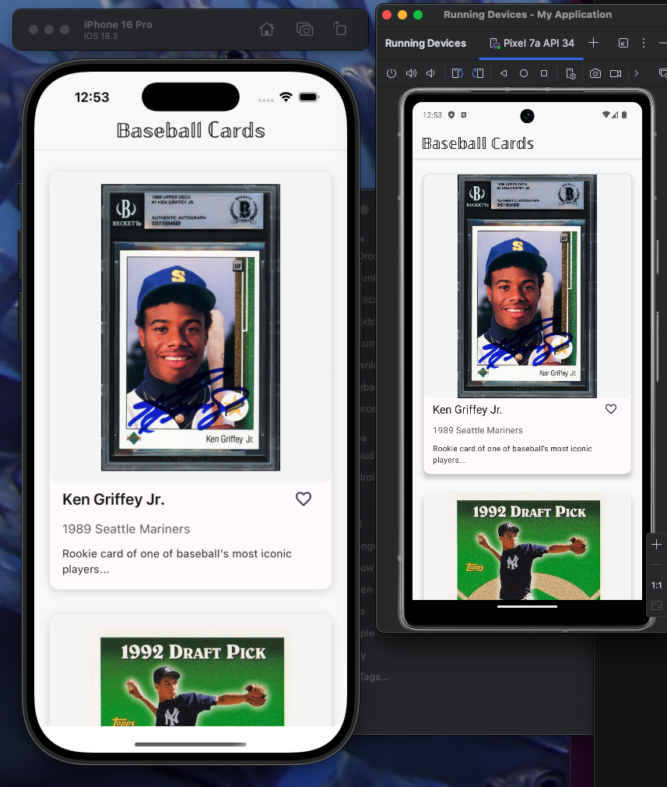
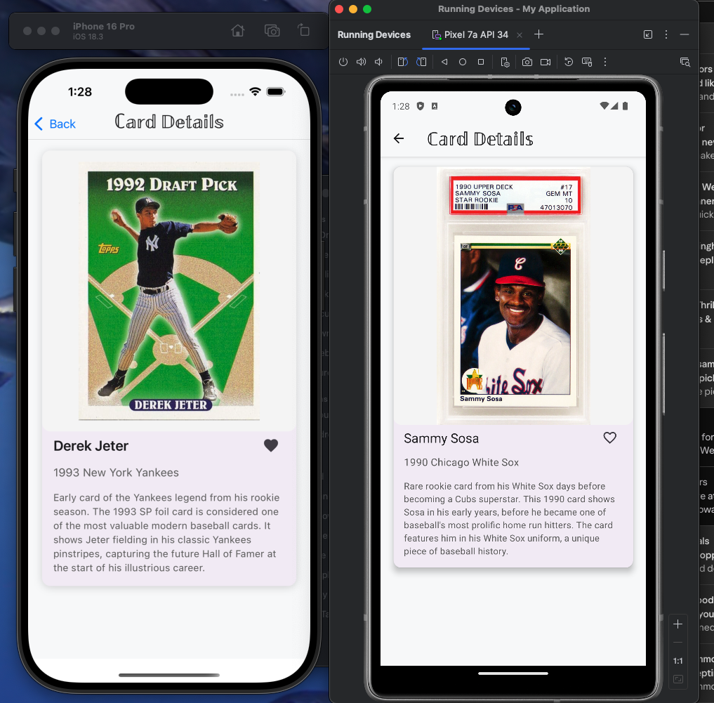

# RNCardList

A React Native app built with Expo and React Relay (against a mock service) for managing a collection of baseball cards. Users can view cards, see detailed information, and like their favorite cards.

## List Screen:



## Detail Screen:



## Screenshots

### Optimistic UI Updates

The like button demonstrates immediate feedback:

1. Heart icon changes instantly on tap
2. Loading indicator shows during request
3. Reverts on error (e.g., when offline)

## Features

- View list of baseball cards
- Card details view
- Like/unlike cards with instant feedback
- Optimistic UI updates
  - Immediate UI response without waiting for server
  - Smooth user experience for like/unlike actions
  - Graceful error handling and state reversion
- Offline capabilities
- Image caching

## Tech Stack

- [React Native](https://reactnative.dev) - A framework for building native apps using React
- [Expo/EAS](https://expo.dev) - Platform and build service for React Native apps
- [React Relay](https://relay.dev) - Production-ready GraphQL client for React
- [TypeScript](https://www.typescriptlang.org) - JavaScript with syntax for types
- [React Navigation](https://reactnavigation.org) - Routing and navigation for React Native apps
- [React Native Paper](https://callstack.github.io/react-native-paper) - Material Design components for React Native

## Prerequisites

- [Node.js](https://nodejs.org) v18 or higher - JavaScript runtime environment
- [npm](https://www.npmjs.com) or [yarn](https://yarnpkg.com) - Package managers for Node.js
- [Expo CLI](https://docs.expo.dev/get-started/installation) - Command line tool for Expo development
- iOS Simulator (for iOS development)
  - macOS - Required for iOS development
  - Xcode (latest version) - iOS development environment
- Android Studio (for Android development)
  - Android SDK - Software development kit for Android
  - Android Emulator - Virtual device for testing Android apps

## Getting Started

1. Clone the repository:

   ```bash
   git clone https://github.com/kbanashek/RNCardList.git
   cd RNCardList
   ```

2. Install dependencies:

   ```bash
   npm install
   ```

3. Start the development server:

   ```bash
   npm start
   ```

4. Open the app:

   - For iOS: Press `i` in the terminal or run `npm run ios`
   - For Android: Press `a` in the terminal or run `npm run android`

5. Unit Tests

   ```bash
   npm run test
   ```

## Development

The app uses a mock GraphQL service for data. All network requests are handled through Relay, with offline support and optimistic updates.

### Optimistic Updates

The app implements optimistic UI updates to provide instant feedback for user actions:

```typescript
// Example from useToggleCardLike hook
commit({
  variables: { input: { cardId } },
  // Update UI immediately
  optimisticResponse: {
    toggleCardLike: {
      card: {
        id: cardId,
        isLiked: true,
      },
    },
  },
  // Revert UI if server request fails
  onError: (error) => {
    // Handle error state
  },
});
```

This pattern:

1. Updates UI immediately when user takes action
2. Sends request to server in background
3. Handles errors by reverting UI if needed

#### Implementation Details

The optimistic updates are implemented using React Relay's mutation API:

1. **State Management**:

   ```typescript
   const [state, setState] = useState<MutationState>({
     loadingCardIds: new Set(), // Track loading state per card
     error: null, // Handle errors globally
   });
   ```

2. **Loading States**:

   - Each card tracks its own loading state
   - UI can show loading indicators while request is pending
   - Prevents duplicate requests for the same card

3. **Error Handling**:
   - Global error state for user feedback
   - Automatic UI reversion on failure
   - Proper cleanup of loading states

#### Component Integration

The `LikeButton` component integrates with the optimistic update system:

```typescript
const LikeButton = ({ cardId, isLiked }) => {
  const { toggleLike, isLoading } = useToggleCardLike();

  return (
    <IconButton
      icon={isLiked ? "heart" : "heart-outline"}
      onPress={() => toggleLike(cardId)}
      disabled={isLoading}
      // Show loading state while request is pending
      loading={isLoading}
    />
  );
};
```

#### Optimistic Updates

1. Enable network debugging in Chrome DevTools
2. Like a card and verify:
   - UI updates immediately
   - Network request is sent in background
   - UI remains updated after request completes
3. Test error handling:
   - Enable airplane mode
   - Like a card
   - Verify UI reverts when offline

#### Offline Testing

1. Load the app with network connection
2. Enable airplane mode
3. Verify:
   - Cards are still visible
   - Images load from cache
   - Like/unlike actions show proper error states
   - Network status banner appears
4. Re-enable network:
   - Banner should disappear
   - Any pending actions should resolve

### Architecture

#### Offline Support

The app uses several strategies to provide a seamless offline experience:

1. **Data Persistence**:

   - Relay stores query data in memory cache
   - Images are pre-cached on first load
   - Network state is monitored via NetInfo

2. **UI Feedback**:

   - Network status banner shows offline state
   - Loading states indicate pending actions
   - Error states show when actions fail
   - Cached data is used when offline

3. **Error Recovery**:
   - Automatic retry when network returns
   - Clear error states on reconnection
   - Preserve user actions when possible
